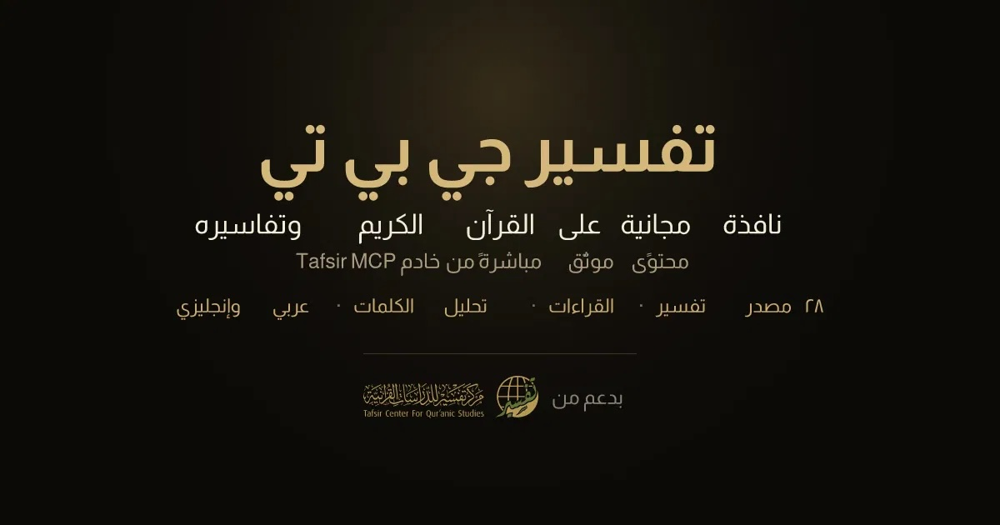

<p align="center">
  
</p>

# تفسير جي بي تي · TafsirGPT

A single‑page Next.js app that is powered **end‑to‑end** by the
[Tafsir MCP server](https://mcp.tafsir.net/mcp) of the
[Tafsir Center for Quranic Studies](https://tafsir.net). Every fact in the UI —
every verse, tafsir line, root count, reason of revelation, statistic and source
name — comes from a **live MCP tool or resource call**. There is **no bundled
Quran data**: ship the app, point it at the server, and it works.

- 🧭 **Two surfaces** behind one header switch — **Chat** (an AI assistant, the default) and **Explore** (a ten‑tab panel UI)
- 💬 **Chat assistant** — a ChatGPT‑style interface powered by **DeepSeek v4 Flash**, answering *only* from live MCP data
- 🔎 **Explore** — ten focused panels for ayah sciences, tafsir, surah cards, word/root analysis, qira’at, asbāb al‑nuzūl, search, page benefits and source catalogs
- 🌙 **Arabic by default**, full **English** support, instant RTL ⇄ LTR
- ☀️ **Dark / light** theme with no flash (pre‑paint restore) + OS‑preference default
- 🖨️ **Export to PDF** — print the chat transcript or the current explore findings as a clean, paginated document
- 📱 **Mobile‑first**, single page, fully responsive
- 🕌 Refined gold / olive / cream scholarly aesthetic (Cairo + Amiri + JetBrains Mono)
- 🔌 Exercises **all 17 MCP tools and all 4 MCP resources**, and **re‑exposes the upstream MCP server** at its own `/mcp` for any MCP client

---

## Table of contents

- [How it works at a glance](#how-it-works-at-a-glance)
- [The two surfaces](#the-two-surfaces)
  - [Explore — the panel UI](#explore--the-panel-ui)
  - [Chat — the DeepSeek assistant](#chat--the-deepseek-assistant)
- [Global UI options](#global-ui-options)
- [How requests are processed](#how-requests-are-processed)
  - [1 · `/api/mcp` — the browser UI proxy](#1--apimcp--the-browser-ui-proxy)
  - [2 · `/api/chat` — the DeepSeek ⇄ MCP agent](#2--apichat--the-deepseek--mcp-agent)
  - [3 · `/mcp` — transparent MCP reverse proxy](#3--mcp--transparent-mcp-reverse-proxy)
  - [The MCP transport (`lib/mcp.ts`)](#the-mcp-transport-libmcpts)
- [Features → MCP tools](#features--mcp-tools)
- [Run it](#run-it)
- [Environment variables](#environment-variables)
- [Project layout](#project-layout)
- [Tech](#tech)

---

## How it works at a glance

```
                                  ┌────────────────────────────────────────┐
                                  │            Browser (one page)            │
                                  │  Header: Chat ⇄ Explore · PDF · + · ع/EN · ☾ │
                                  └───────────────┬──────────────┬───────────┘
                                                  │              │
                       Explore panels            │              │   Chat assistant
                       (lib/client.ts)           │              │   (lib/chat-client.ts)
                                                  ▼              ▼
                                     POST /api/mcp        POST /api/chat  (NDJSON stream)
                                          │                     │
                                          ▼                     ▼
                              app/api/mcp/route.ts     app/api/chat/route.ts
                              allowlist 17 tools       DeepSeek agentic loop
                              + 4 resources            (tool calls → MCP → answer)
                                          │                     │
                                          └─────────┬───────────┘
                                                    ▼
                                            lib/mcp.ts  (Streamable‑HTTP MCP client:
                                            initialize → notify → tools/call,
                                            SSE parsing, session‑affinity retries)
                                                    ▼
                                        https://mcp.tafsir.net/mcp   (upstream)

         ┌─ also exposed ────────────────────────────────────────────────────────────┐
         │  app/mcp/route.ts  —  transparent reverse proxy:  /mcp  →  upstream /mcp     │
         │  any standard MCP client (Claude, Cursor, MCP Inspector) can connect to it  │
         └────────────────────────────────────────────────────────────────────────────┘
```

The first paint is correct without a client round‑trip: the **surface** (`?mode=`),
the active **explore tab** (`?tab=`) and the **locale** (a `locale` cookie) are all
resolved **server‑side** in `app/page.tsx`, and the **theme** is restored by a tiny
pre‑paint script in `app/layout.tsx` — so there is no flash of the wrong mode,
language or theme.

---

## The two surfaces

The header has a segmented **Chat ⇄ Explore** switch. **Chat is the default**
surface; add `?mode=explore` to the URL (or click the switch) to land on Explore.

### Explore — the panel UI

On entry, Explore loads every immutable catalog it needs in **one request**
(`GET /api/mcp?bootstrap=1` → surah list, tafsir sources, science sources and the
Quran overview, all cached server‑side for 30 minutes). Then it shows ten tabs;
the active tab is mirrored into `?tab=` so any view is shareable/bookmarkable.

| Tab (ar / en)                    | What you pick                                                            | MCP tool(s)                                              |
| -------------------------------- | ----------------------------------------------------------------------- | ------------------------------------------------------- |
| أسباب النزول / **Reasons of revelation** *(default)* | surah + ayah                                            | `fetch_nuzool_reason`                                    |
| الآية والعلوم / **Ayah & sciences** | surah + ayah, toggle science layers: tajwīd, iʿrāb, gharīb, qirāʾāt, tadabbur | `fetch_ayah`                                  |
| التفسير / **Tafsir**             | surah + ayah, choose source(s) from 28 tafsirs, paginate long texts     | `fetch_tafsir`                                          |
| بطاقة السورة / **Surah card**    | surah, optional English introduction                                    | `fetch_surah_info`, `get_surah_statistics`             |
| تحليل الكلمة / **Word analysis** | surah + ayah + word number, aspects: meaning, iʿrāb, ṣarf, stats, qirāʾāt | `analyze_word`                                         |
| الجذور اللغوية / **Roots**       | a triliteral root (e.g. رحم) — stats + every occurrence, jump to ayah    | `get_root_stats`, `find_root_occurrences`              |
| القراءات / **Readings**          | surah + ayah                                                            | `get_qeraat_variants`                                   |
| البحث / **Search**               | a query (Quran search is diacritic‑insensitive), scope = Quran or a tafsir, results limit | `search_quran_text`, `search_in_tafsir`     |
| فوائد الصفحة / **Page benefits** | a mushaf page (1–604)                                                    | `get_page_fawaed`                                       |
| المصادر والإحصاء / **Sources & stats** | browse catalogs, overall Quran stats, check which sources cover an ayah | `get_quran_overview`, `list_all_sources`, `list_tafsir_sources`, `list_science_sources`, `list_sources_for_ayah` |

Each panel renders the server’s scholarly text **verbatim, never summarized**, with
its `attribution` and footnotes preserved (per the server’s display charter).
Collection results (search, root occurrences) are paginated; long tafsir texts
are split into navigable parts.

### Chat — the DeepSeek assistant

A clean, ChatGPT‑style assistant that is **100 % grounded in the Tafsir MCP** — it
answers from tool results only, never from the model’s own training data.

```
Browser (components/chat/ChatView.tsx)
   │  POST /api/chat { messages, locale }            ← streams NDJSON events back
   ▼
Next.js route (app/api/chat/route.ts)
   │  agentic loop:  DeepSeek → tool calls → MCP → DeepSeek → … → answer
   ├─ buildSystemPrompt()  ── injects the live source + surah catalogs so the
   │                          model always passes valid slugs / surah numbers
   ├─ buildToolDefs()      ── the 17 MCP tools as DeepSeek function specs
   ▼                          (lib/chat-system.ts)
DeepSeek v4 Flash  ⇄  lib/mcp.ts callTool()  ⇄  https://mcp.tafsir.net/mcp
```

What you get in the UI:

- **Live tool transparency** — every MCP invocation appears as a status chip
  (running ▸ ok ✓ / error ✕) with the key argument (e.g. `2:255`, a root, a page),
  and the answer streams token‑by‑token as Markdown with a copy button.
- **Starter questions**, a **prompt editor** dialog for longer questions, a
  **Stop** button that aborts the in‑flight request, and a header **+** to start a
  fresh chat.
- **Context guard** — the composer estimates the conversation size and blocks
  sending before it would exceed DeepSeek’s 1 M‑token window, with a clear warning.

Design points enforced server‑side (`app/api/chat/route.ts`, `lib/chat-system.ts`):

- **MCP‑only grounding** — a strict system prompt forbids answering from the
  model’s own knowledge; it must fetch via tools and may quote only what a tool
  returned (no fabricated books, scholars, or rulings — it says so when the corpus
  doesn’t cover a point). Any “Sources” it lists are exactly the tools’ sources.
- **Stays on topic** — off‑topic questions get a one‑line decline and a nudge back
  to Quran/tafsir; in‑scope fiqh/creed/language questions are answered from the
  tafsir corpus (e.g. Qurṭubī’s *Aḥkām*) via `search_quran_text` discovery.
- **Thinking‑model handling** — DeepSeek v4 Flash streams `reasoning_content`,
  which is captured and echoed back in each assistant turn (required, or the model
  leaks raw tool‑call markup); leaked control markers are trimmed defensively, and
  a forced tool‑free final round guarantees a synthesised answer if the tool budget
  is exhausted.
- **Guardrails** — at most 8 model⇄tool rounds, 24 turns of history, 8 000 chars per
  message and 40 000 chars per tool result fed back; the tool allowlist is enforced
  at execution time; and any secret‑looking string is redacted from error messages.

> Chat requires a real DeepSeek API key (see [Environment variables](#environment-variables)).

---

## Global UI options

| Control (header) | Effect | How it persists |
| ---------------- | ------ | --------------- |
| **Chat ⇄ Explore** switch | toggles the active surface | reflected in `?mode=` |
| **Export PDF** (tray icon) | opens the browser print dialog for “Save as PDF” of the current surface | — |
| **+** (new chat) | clears the conversation and focuses the composer | — |
| **ع / EN** | toggles Arabic ⇄ English, flipping direction (RTL ⇄ LTR) | `locale` cookie (server‑rendered next load) |
| **☀ / ☾** | toggles dark ⇄ light theme | `theme` in `localStorage` (restored pre‑paint) |

**PDF export** (`lib/print.ts`, `components/Print.tsx`) deliberately drives the
browser’s native print pipeline rather than rasterizing the DOM, so Arabic stays
**vector and selectable**, fonts/colours stay faithful at any zoom, and real
pagination rules (`break-inside` / `break-after` in `globals.css`) keep verses,
cards and headings from being sliced across pages. A print‑only masthead leads the
document, and every collapsed `<details>` footnote is expanded just before printing
so no scholarly reference is silently dropped.

---

## How requests are processed

There are **three** server entry points, each with a distinct job.

### 1 · `/api/mcp` — the browser UI proxy

The Explore panels never talk to the upstream directly; they go through
`app/api/mcp/route.ts`, a small JSON helper (`lib/client.ts` on the browser side):

- `GET /api/mcp?bootstrap=1` → loads the surah/tafsir/science catalogs + Quran
  overview in one shot (cached 30 min in‑process).
- `POST /api/mcp` with `{ kind: "tool", name, args }` or `{ kind: "resource", uri }`.
- A strict **allowlist** of exactly **17 tools** and **4 resources** — anything else
  is rejected. Tool‑level failures (bad slug, ayah out of range) return `422`;
  transport failures return `502`.

### 2 · `/api/chat` — the DeepSeek ⇄ MCP agent

`app/api/chat/route.ts` runs the agentic loop and streams **newline‑delimited JSON
(NDJSON)** back so the UI can render live:

```
{type:"delta",  text}                      — a chunk of the answer
{type:"tool_call",   id, name, args}       — the model invoked an MCP tool
{type:"tool_result", id, name, ok, error?} — the tool returned
{type:"done"}                              — turn complete
{type:"error", message}                    — fatal error
```

Each round: stream a DeepSeek completion → if it requested tools, execute each one
through `lib/mcp.ts` (allowlist re‑checked here) and feed the results back → repeat
until the model produces a final text answer (or the round budget forces one).

### 3 · `/mcp` — transparent MCP reverse proxy

Besides driving its own UI, the app **re‑exposes the upstream MCP server** at its
own `/mcp` path, so any standard MCP client can connect to it directly:

```
https://<this-app>/mcp   →  proxies  →  https://mcp.tafsir.net/mcp
```

`app/mcp/route.ts` does **not** interpret the protocol — it forwards the raw request
and streams the raw response back, so the full Streamable‑HTTP transport survives
end‑to‑end: SSE bodies, the `mcp-session-id` handshake, every JSON‑RPC method, and
any future server capability all pass through verbatim. It adds permissive CORS
(exposing `mcp-session-id`) so browser clients like the MCP Inspector work too, and
answers the CORS `OPTIONS` preflight locally (the upstream rejects `OPTIONS` with
405). Being a faithful pass‑through, it inherits the upstream’s behavior exactly —
including the multi‑instance session‑affinity flakiness handled below.

### The MCP transport (`lib/mcp.ts`)

The upstream speaks **MCP protocol 2024‑11‑05** over HTTP with Server‑Sent‑Event
responses. Every logical request is a 3‑step handshake that must hit the same
backend instance:

```
1. POST initialize                 → returns an `mcp-session-id` header
2. POST notifications/initialized   (with the session id)
3. POST tools/call | resources/read (with the session id) → SSE response
```

Notable details handled here:

- **SSE parsing** that joins multi‑line `data:` fields and returns the last
  JSON‑RPC message carrying a `result`/`error`.
- **Session‑affinity retries** — the server runs on a multi‑instance Fly.io router
  with no sticky sessions, so a fresh session id occasionally lands on another
  instance (`Session not found`). The whole handshake is retried with jittered
  backoff.
- **Multi‑block results** — collection tools (`search_*`, `find_root_occurrences`)
  return one `content` block per item; single‑value tools return one. The client
  normalizes both.
- **Guidance stripping** — fields beginning with `_` (e.g. `_display`) are LLM
  display hints, not user content, and are removed before reaching the UI.
- **In‑process catalog cache** — immutable catalog/overview reads are cached for
  30 minutes so chat warm‑up and Explore bootstrap add no repeat round‑trips.

---

## Features → MCP tools

| Section (ar / en)             | MCP tool(s)                                              |
| ----------------------------- | ------------------------------------------------------- |
| الآية والعلوم / Ayah & sciences | `fetch_ayah` (tajwīd, iʿrāb, gharīb, qirāʾāt, tadabbur) |
| التفسير / Tafsir              | `fetch_tafsir` (28 sources, paginated)                  |
| بطاقة السورة / Surah card     | `fetch_surah_info`, `get_surah_statistics`              |
| تحليل الكلمة / Word analysis  | `analyze_word` (meaning, iʿrāb, ṣarf, stats, qirāʾāt)   |
| الجذور اللغوية / Roots        | `get_root_stats`, `find_root_occurrences`              |
| القراءات / Qirāʾāt            | `get_qeraat_variants`                                   |
| أسباب النزول / Revelation     | `fetch_nuzool_reason`                                   |
| البحث / Search                | `search_quran_text`, `search_in_tafsir`                |
| فوائد الصفحة / Page benefits  | `get_page_fawaed`                                       |
| المصادر والإحصاء / Sources    | `get_quran_overview`, `list_all_sources`, `list_tafsir_sources`, `list_science_sources`, `list_sources_for_ayah` |

Resources used: `quran://surahs`, `quran://tafsirs`, `quran://sciences`,
`quran://schema`.

---

## Run it

```bash
npm install
npm run dev      # http://localhost:3000
# or
npm run build && npm start
```

Explore works out of the box (no key needed). For **Chat**, set a DeepSeek key:

```bash
echo 'DEEPSEEK_API_KEY=sk-...' >> .env.local   # .env.local is gitignored
# optional: DEEPSEEK_MODEL=deepseek-v4-flash
```

## Environment variables

All optional except the DeepSeek key, which is required for Chat mode.

| Var                  | Purpose                                  | Default                        |
| -------------------- | ---------------------------------------- | ------------------------------ |
| `DEEPSEEK_API_KEY`   | DeepSeek key — **required for Chat mode**| —                              |
| `DEEPSEEK_MODEL`     | DeepSeek model                           | `deepseek-v4-flash`            |
| `DEEPSEEK_BASE_URL`  | DeepSeek completions endpoint            | `https://api.deepseek.com/chat/completions` |
| `MCP_ENDPOINT`       | Upstream MCP server (UI proxy + `/mcp`)  | `https://mcp.tafsir.net/mcp`   |
| `NEXT_PUBLIC_SITE_URL` | Canonical/OG base URL                  | `http://localhost:3000`        |

## Project layout

```
app/
  page.tsx              server entry — resolves mode/tab/locale for first paint
  layout.tsx            metadata, fonts, pre‑paint theme restore, OG/Twitter cards
  api/mcp/route.ts      browser UI proxy (allowlist of 17 tools + 4 resources)
  api/chat/route.ts     DeepSeek ⇄ MCP agentic loop, NDJSON streaming
  mcp/route.ts          transparent MCP reverse proxy (re‑exposes upstream)
  opengraph-image.tsx   dynamically generated social card
components/
  Shell.tsx Header.tsx  chrome: surface switch, theme, locale, PDF, new chat
  ExploreView.tsx       the ten‑tab explorer
  panels/*              one component per Explore tab
  chat/*                ChatView, Markdown renderer, prompt editor
  Print.tsx             print masthead + <details> expansion for PDF export
lib/
  mcp.ts                server‑side Streamable‑HTTP MCP client (handshake/SSE/retries)
  client.ts             browser helper for /api/mcp
  chat-client.ts        browser reader for the /api/chat NDJSON stream
  chat-system.ts        system prompt + tool catalog for the chat model
  i18n.ts               ar/en dictionaries, digit localization, error mapping
  explore-tabs.ts print.ts og-image.tsx types.ts surah-names.ts
public/
  opengraph-image.jpeg logo.svg
```

## Tech

Next.js 15 (App Router) · React 19 · TypeScript · Tailwind CSS 3 ·
`react-markdown` + `remark-gfm` (chat answers) · DeepSeek v4 Flash (chat) · Cairo +
Amiri + JetBrains Mono fonts · zero bundled Quran data — all content is fetched
live from the Tafsir MCP server.
